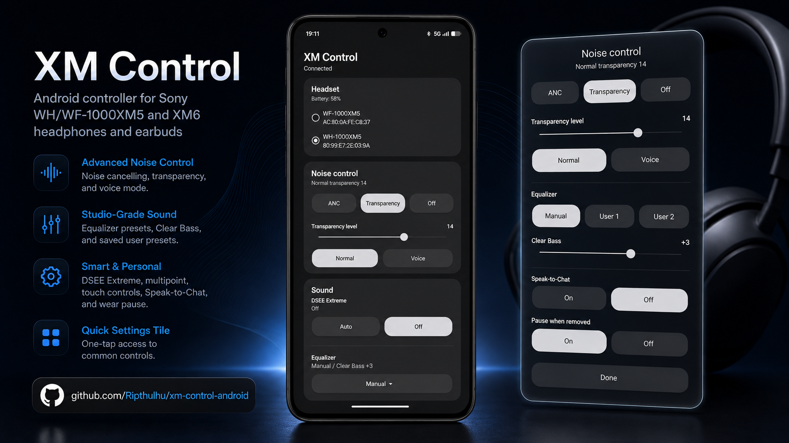

# XM Control Android



Android controller for Sony WH/WF-1000XM5 and XM6 headphones and earbuds.

## Download

Download the latest APK from the [Releases](https://github.com/Ripthulhu/xm-control-android/releases) page.

## Features

- Noise cancelling, transparency, and off modes
- Transparency level and voice mode
- Equalizer presets, Clear Bass, and User 1/User 2 preset storage
- DSEE Extreme, connection quality, multipoint, touch controls, Speak-to-Chat, wear pause, and automatic power off
- One Quick Settings tile for common controls

## Build

Open this folder in Android Studio, or build from a terminal with Android SDK 36 installed:

```sh
./gradlew :app:assembleDebug
```

The headset must already be paired in Android Bluetooth settings.

## Notes

This project is not affiliated with Sony.
